# Boxy — Architecture Overview

> **Last updated:** 2026-03-15
>
> Boxy is a resource pooling and sandbox orchestration tool. It pre-provisions
> pools of VMs, containers, and other resources, then assembles them into
> on-demand sandboxes for labs, training, pentesting, and development
> environments.

---

## Table of Contents

- [System Overview](#system-overview)
- [Runtime Modes](#runtime-modes)
- [Domain Model](#domain-model)
- [Package Architecture](#package-architecture)
- [Key Abstractions](#key-abstractions)
  - [Policy Controller (Observe → Decide → Act)](#policy-controller)
  - [Provider SDK & Driver Model](#provider-sdk--driver-model)
  - [Agent Layer](#agent-layer)
  - [Store Layer](#store-layer)
- [Reconciliation Flow](#reconciliation-flow)
- [Sandbox Allocation Flow](#sandbox-allocation-flow)
- [Data Flow](#data-flow)
- [Configuration Model](#configuration-model)
- [Technology Stack](#technology-stack)

---

## System Overview

Boxy follows a **Vault-like single-binary architecture** — one binary (`boxy`)
operates in three modes: daemon server, CLI client, and distributed agent.

```
┌──────────────────────────────────────────────────────────────────┐
│                        boxy serve (daemon)                       │
│                                                                  │
│   ┌─────────────┐   ┌────────────────┐   ┌──────────────────┐  │
│   │  REST API    │   │  gRPC Server   │   │ PolicyController │  │
│   │  (CLI cmds)  │   │  (agents)      │   │ (reconcile loop) │  │
│   └──────┬───────┘   └───────┬────────┘   └────────┬─────────┘  │
│          │                   │                     │             │
│   ┌──────▼───────────────────▼─────────────────────▼──────────┐ │
│   │              Core: Pool Manager + Sandbox Manager          │ │
│   │                          │                                 │ │
│   │              ┌───────────▼────────────┐                    │ │
│   │              │     Store (bbolt)      │                    │ │
│   │              └────────────────────────┘                    │ │
│   └───────────────────────────┬────────────────────────────────┘ │
│                               │                                  │
│   ┌───────────────────────────▼────────────────────────────────┐ │
│   │            Embedded Agent (local providers)                 │ │
│   │     ┌──────────┐  ┌──────────┐  ┌──────────┐              │ │
│   │     │  Docker   │  │ Hyper-V  │  │ DevFctry │  ...drivers  │ │
│   │     └──────────┘  └──────────┘  └──────────┘              │ │
│   └────────────────────────────────────────────────────────────┘ │
└──────────────────────────────────────────────────────────────────┘

         Remote hosts:
┌──────────────────────────────────┐  ┌──────────────────────────┐
│      boxy agent (host A)         │  │   boxy agent (host B)    │
│  gRPC ──► server                 │  │  gRPC ──► server         │
│  auto-discovered drivers         │  │  auto-discovered drivers │
└──────────────────────────────────┘  └──────────────────────────┘
```

---

## Runtime Modes

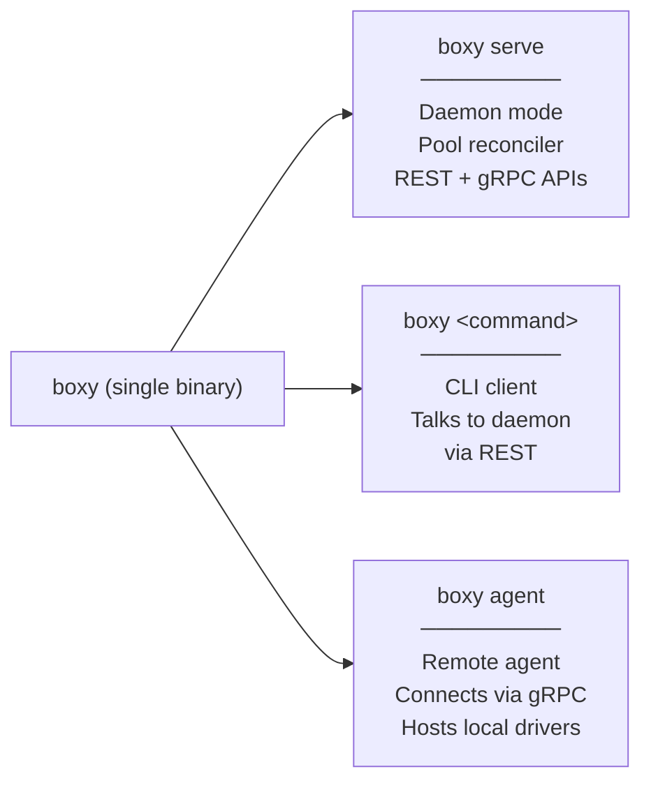

| Mode | Purpose | Transport |
|------|---------|-----------|
| `boxy serve` | Long-running daemon: reconciles pools, serves APIs | Listens on REST + gRPC |
| `boxy <cmd>` | CLI client: sandbox/pool management commands | Connects to daemon via REST |
| `boxy agent` | Remote agent on a different host | Dials server via gRPC/TLS |

---

## Domain Model

These are the core nouns in the system. All defined in `pkg/model/`.

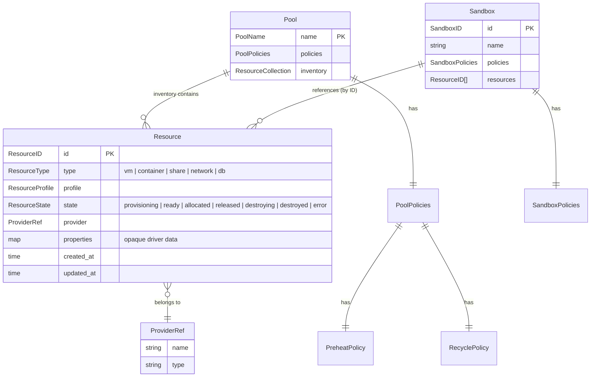

### Resource Lifecycle

Resources flow through a one-way lifecycle. Once allocated to a sandbox, they
**never** return to a pool (see [ADR-0002](adr/0002-no-resource-recycling.md)).

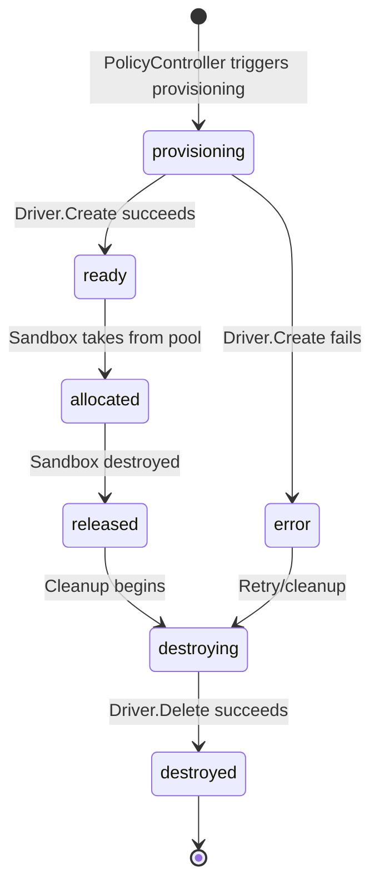

---

## Package Architecture

Boxy enforces a strict **`internal/` vs `pkg/` boundary** — the Go compiler
prevents external consumers from importing `internal/` packages.

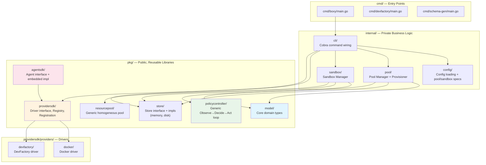

### Dependency Rule

> **`pkg/` packages have zero dependencies on `internal/`.**
>
> This is enforced by the Go compiler. `pkg/` packages are self-contained
> libraries that can be imported independently.

| Layer | Depends On | Purpose |
|-------|-----------|---------|
| `cmd/` | `internal/cli` | Binary entry points |
| `internal/cli` | `internal/*`, `pkg/*` | CLI wiring, server bootstrap |
| `internal/pool` | `pkg/model`, `pkg/store`, `pkg/policycontroller` | Pool reconciliation |
| `internal/sandbox` | `pkg/model`, `pkg/store`, `pkg/resourcepool` | Sandbox creation + allocation |
| `pkg/model` | stdlib only | Core domain types |
| `pkg/store` | `pkg/model` | Persistence interface |
| `pkg/policycontroller` | stdlib only | Generic control loop |
| `pkg/resourcepool` | stdlib only | Generic pool data structure |
| `pkg/providersdk` | stdlib only | Driver interface + registry |
| `pkg/agentsdk` | `pkg/providersdk` | Agent abstraction |

---

## Key Abstractions

### Policy Controller

The `policycontroller` package (`pkg/policycontroller/`) implements a generic
**Observe → Decide → Act** reconciliation loop using Go generics:

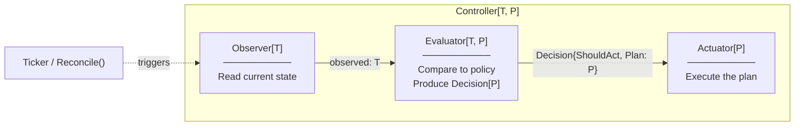

**Key properties:**
- **Generic over T (observed state) and P (plan)** — domain packages supply
  concrete types
- **Stateless and idempotent** — every tick re-derives what's needed from scratch
- Can run as a one-shot (`Reconcile()`) or in a loop (`Run(ctx, interval)`)
- Policy is not a separate input — it's embedded in the Evaluator implementation

The pool manager (`internal/pool/`) wires this up with concrete types:
- `T = observed{pool, now}` — the pool's inventory + current time
- `P = plan{pool, stale, toProvision, reason}` — what to destroy and provision

---

### Provider SDK & Driver Model

The `providersdk` package defines how Boxy talks to infrastructure:

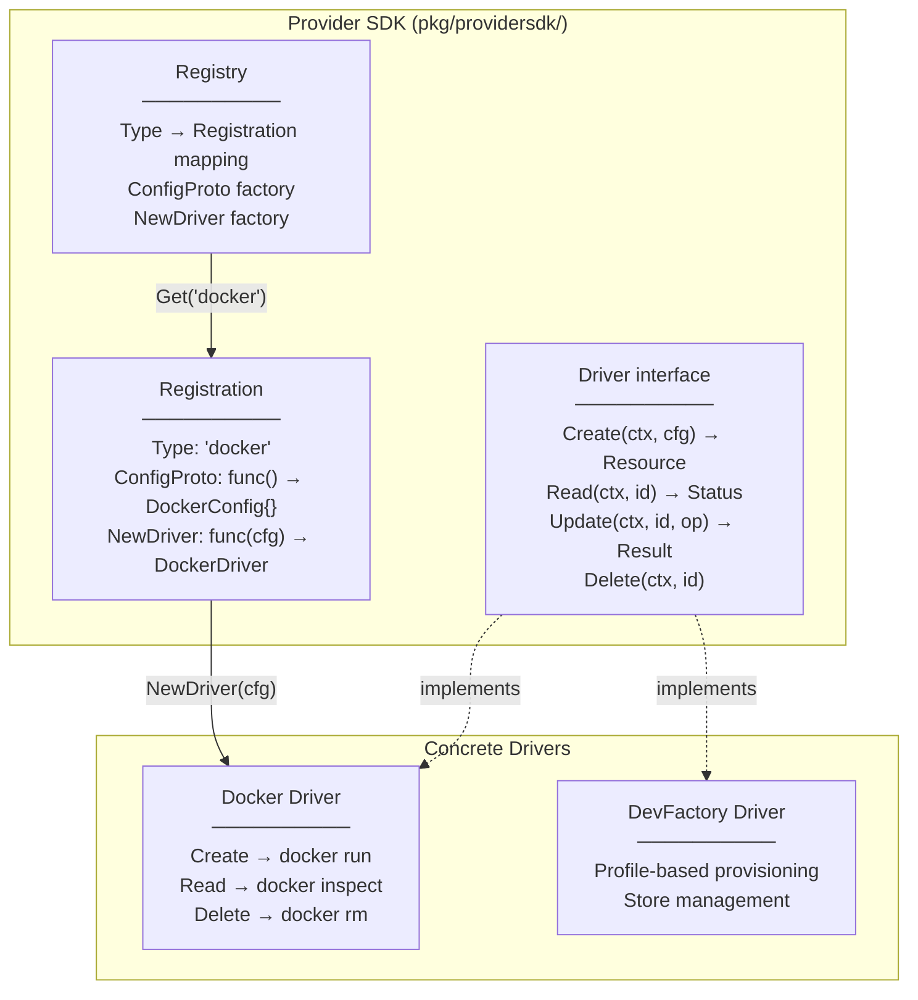

**Registration pattern:** Drivers self-register via a `Registration` struct
containing a `ConfigProto` factory (for YAML deserialization) and a `NewDriver`
factory. The `builtins` package calls `RegisterBuiltins(registry)` at startup
to wire all built-in drivers.

---

### Agent Layer

Agents are the **execution layer** — Boxy core never talks to drivers directly.

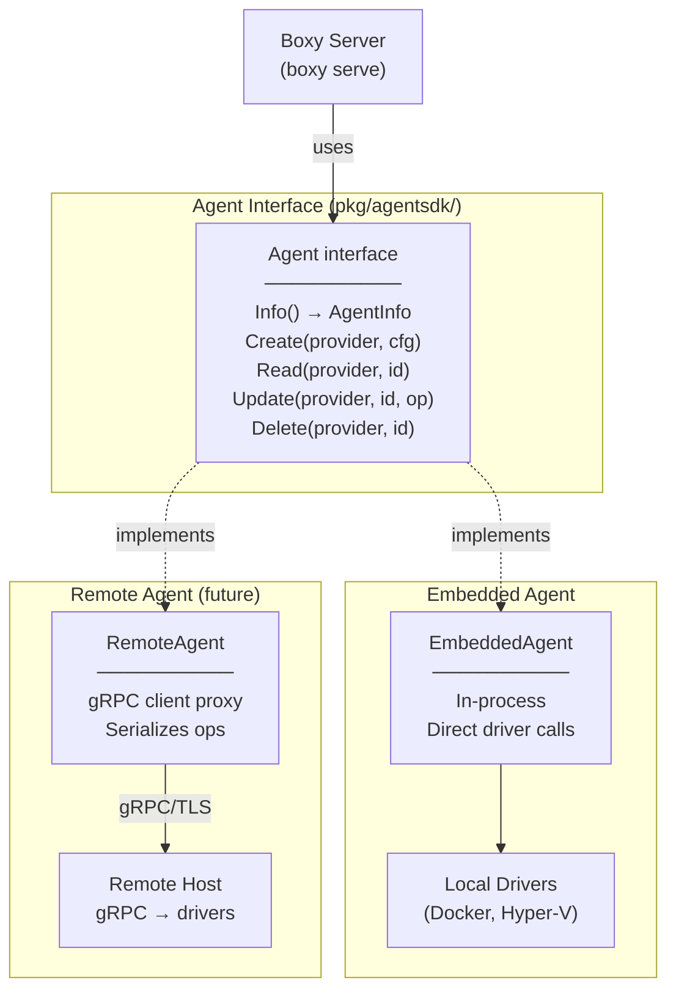

**Transparency:** The server uses the `Agent` interface uniformly. Whether the
agent is embedded (in-process, direct function calls) or remote (gRPC proxy)
is transparent to the server code.

---

### Store Layer

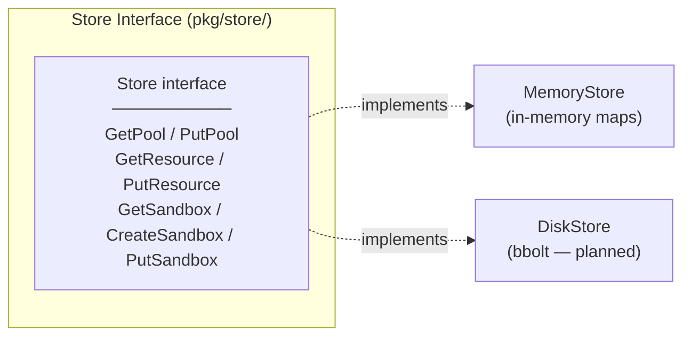

Currently ships with a `MemoryStore` for development. The planned production
store is **bbolt** (pure Go embedded key-value store). Config is NOT stored
in the database — it's read from `boxy.yaml` on startup.

---

## Reconciliation Flow

This is the core runtime loop. The PolicyController continuously compares
desired state (from pool policy) against actual state (from the store) and
takes corrective action.

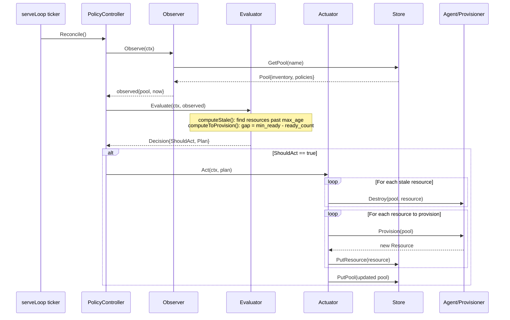

---

## Async Sandbox Fulfillment Flow

Sandbox creation is accepted immediately, then fulfilled asynchronously by the
daemon reconcile loop. Allocated resources are still **taken** from pools
(never returned).

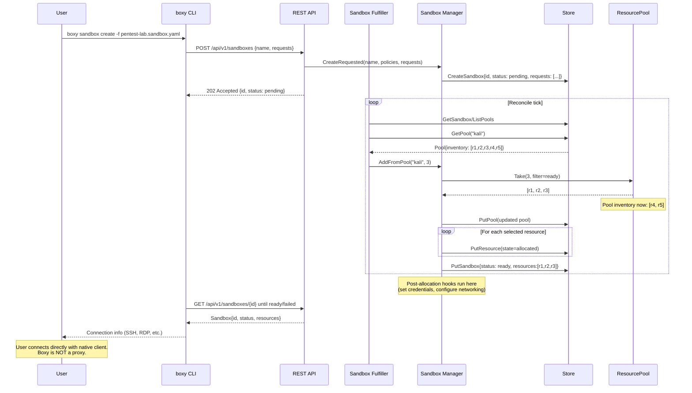

---

## Data Flow

End-to-end data flow showing how configuration becomes running sandboxes:

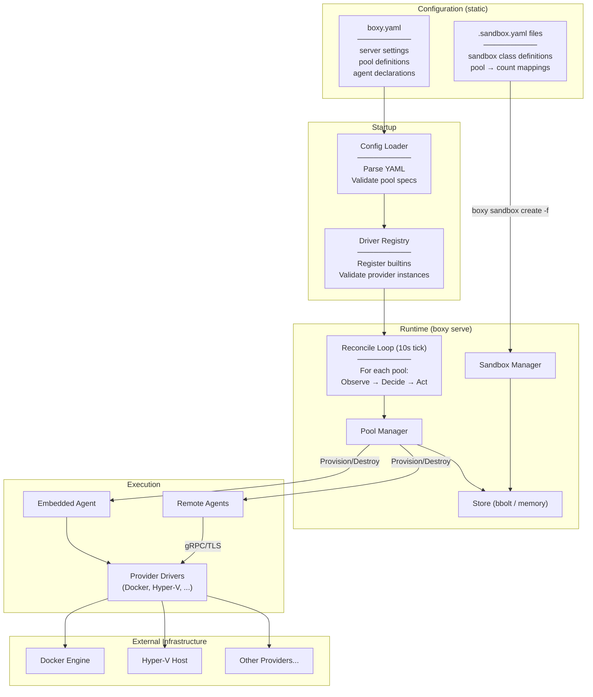

---

## Configuration Model

Configuration is **declarative and stateless**. Runtime state lives in the store.

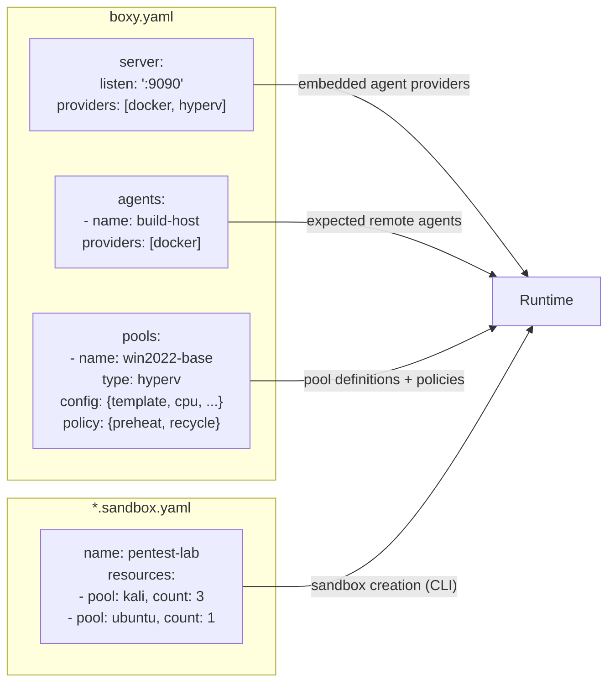

**Key design decisions:**
- Pool `config:` is an **opaque blob** — interpreted only by the driver, not by Boxy core
- Pool `type:` maps directly to a driver (e.g., `type: docker` → Docker driver)
- No separate "blueprint" or "template" entity — the pool IS the spec
- Sandbox definitions are separate files, version-controllable

---

## Technology Stack

| Component | Technology | Purpose |
|-----------|-----------|---------|
| Language | **Go 1.22** | Core implementation |
| CLI Framework | **Cobra** (`spf13/cobra`) | Command-line interface |
| Config Format | **YAML** (`gopkg.in/yaml.v3`) | Configuration files |
| State Store | **bbolt** (planned) / Memory (current) | Runtime state persistence |
| Server-Agent RPC | **gRPC over TLS** (planned) | Agent-server communication |
| Client-Server API | **REST/HTTP** (planned) | CLI-server communication |
| Auth | **JWT** (planned) | Agent registration + auth |
| Task Runner | **Taskfile** (`Taskfile.yml`) | Build and development tasks |

### Project Status

Boxy is in **early development**. The domain model, policy controller, provider
SDK, and pool/sandbox managers are implemented. The REST API, gRPC transport,
and remote agent support are on the roadmap.

---

## Architectural Decision Records

- [ADR-0001: Resource Identity and Provider Handle](adr/0001-resource-identity-and-provider-handle.md) — (Deprecated) Early discussion on resource identity
- [ADR-0002: Resources Never Return to a Pool](adr/0002-no-resource-recycling.md) — Resources are single-use; pools only hold unused inventory
